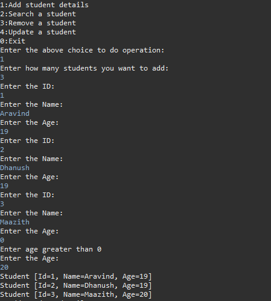
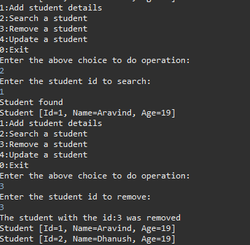
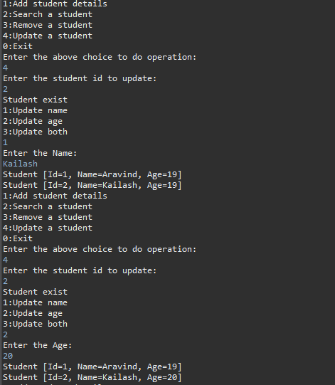
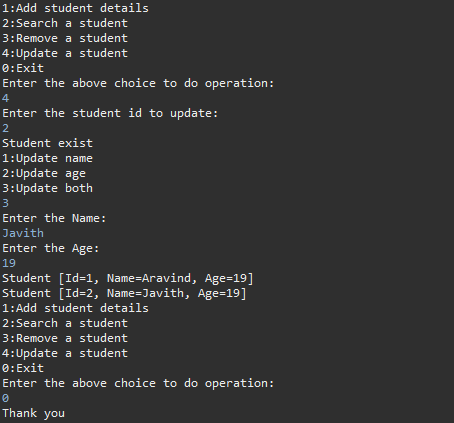

# Student Management System (Java)

A console-based CRUD application built using Java.

## Features

* Add student
* Search student by ID
* Update student details
* Remove student
* Prevent duplicate student IDs
* Age validation

## Technologies Used

* Java
* ArrayList (Collections Framework)
* Iterator
* OOP (Encapsulation)
* Git & GitHub

## Project Description

## Program Screenshots

### Add Student

### Search & Remove Student

### Update Student

### Update & Exit

This project demonstrates CRUD operations using Java collections.

## Author

Aravindan k
